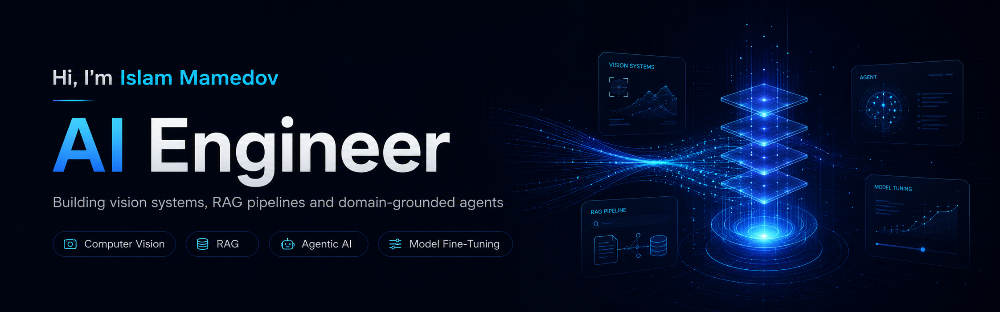

  

<h1 align="center">Islam Mamedov</h1>

  <strong>Graduate AI & LLM Engineer · RAG · Computer Vision · Agentic Systems</strong>

  I build practical AI systems that retrieve evidence, use tools, reason through tasks, and produce useful results.

  <a href="https://github.com/islam-mamedov">GitHub</a>
  ·
  <a href="https://huggingface.co/islam-mamedov">Hugging Face</a>
  ·
  <a href="mailto:islammamedov132004@gmail.com">Email</a>

---

## About Me

I am a Computer Science graduate with a double major in **Artificial Intelligence and Cybersecurity**.

My main interests are LLM applications, retrieval-augmented generation, agentic workflows, computer vision, and full-stack AI development. I enjoy building complete systems that include evaluation, backend services, databases, testing, and a usable interface.

I am currently open to graduate roles in **AI Engineering, LLM Engineering, Machine Learning, and Software Engineering**.

---

## Featured Projects

### 1. FastAPI Codebase Q&A

An evaluation-driven RAG system for asking technical questions about the FastAPI codebase.

The application searches FastAPI source code, documentation, and resolved GitHub issues before generating an answer. It returns file, symbol, and line-level references so each response can be checked against the original source.

  

**Highlights**

- AST-aware chunking with Tree-sitter
- Dense retrieval, BM25, reranking, and query-rewriting experiments
- Grounded citations and evidence-aware refusal
- Labelled benchmark for retrieval and answer quality
- Resumable ingestion, caching, retries, and regression tests

**Results:** Recall@5 `0.91` · MRR `0.71` · Faithfulness `0.89` · Correctness `0.91` · Refusal accuracy `7/7`

**Stack:** Python · LLMs · RAG · Streamlit · ChromaDB · BGE Embeddings · Tree-sitter · Pytest

[Source Code](https://github.com/islam-mamedov/codebase-rag) · [Live Demo](https://huggingface.co/spaces/islam-mamedov/fastapi-codebase-qa)

---

### 2. InsightForge

An LLM-powered data analyst that investigates business questions against a PostgreSQL database.

The system plans an investigation, discovers the relevant schema, generates SQL, checks it for safety, executes it in a read-only transaction, validates the result, and explains the final findings.

  

**Highlights**

- Eight-stage investigation workflow
- SQL inspection with SQLGlot
- Read-only execution and restricted-table protection
- Automatic SQL repair with controlled retries
- Validation for empty outputs, null-only columns, and join duplication
- Token, latency, cost, and audit tracking

**Project snapshot:** `103 tests` · `~650,000 database rows` · `6 planted anomalies` · `3 repair attempts maximum`

**Stack:** Python · LLM Tool Calling · FastAPI · PostgreSQL · SQLAlchemy · SQLGlot · Docker · Pydantic

[Source Code](https://github.com/islam-mamedov/insightforge)

---

### 3. Concrete Inspection Agent

A multimodal AI system that combines concrete-defect detection with evidence-grounded repair guidance.

The vision model detects cracks, corrosion, and spalling. A LangGraph workflow then retrieves relevant information from USACE engineering guidance and uses the evidence to produce a cited response.

  

**Highlights**

- Fine-tuned YOLOv8 detector
- LangGraph workflow with retrieval grading and query rewriting
- ChromaDB knowledge base with section metadata
- Cited answers and unsupported-question refusal
- Evaluation for retrieval, faithfulness, citations, and refusals

**Results:** `1,770 images` · `5,897 objects` · Retrieval `28/28` · Citation validity `33/33` · Faithfulness `31/32`

**Stack:** Python · YOLOv8 · LLMs · LangGraph · LangChain · ChromaDB · Gradio

[Source Code](https://github.com/islam-mamedov/inspection-agent) · [Live Demo](https://huggingface.co/spaces/islam-mamedov/inspection-agent)

---

## Additional Projects

### Java Multi-Agent Vehicle Routing System

A Java and JADE multi-agent system for solving the Vehicle Routing Problem.

The system uses a master routing agent and delivery agents, together with genetic algorithms, simulated annealing, nearest-neighbour search, and local optimisation.

**Stack:** Java · JADE · Multi-Agent Systems · Genetic Algorithm · Simulated Annealing

[View Repository](https://github.com/islam-mamedov/vrp-mas-intelligent-system)

### Swinburne Campus App

A mobile-first campus platform for navigation, safety information, student support, events, and administration.

I worked mainly on the admin console, emergency and exit-management workflows, support features, full-stack integration, and team coordination.

**Stack:** Next.js · React · TypeScript · Supabase · Tailwind CSS

[View Repository](https://github.com/islam-mamedov/swinburne-app-group13)

---

## Technical Skills

**AI & LLMs:** Large Language Models, RAG, LangGraph, tool calling, embeddings, vector search, prompt engineering, computer vision, object detection, model evaluation

**Backend & Data:** Python, FastAPI, PostgreSQL, SQLAlchemy, ChromaDB, Pydantic, REST APIs, Docker

**Software Engineering:** Java, TypeScript, Next.js, React, Git, Linux, testing, CI/CD

---

## How I Work

I try to keep my AI projects practical, measurable, and honest.

That means testing retrieval instead of assuming it works, checking whether generated answers are supported, designing safe boundaries around tools and databases, and documenting where a system can fail.

---

  <strong>Building AI systems that move from raw data to evidence, reasoning, and useful action.</strong>

  <a href="mailto:islammamedov132004@gmail.com">Contact me</a>

