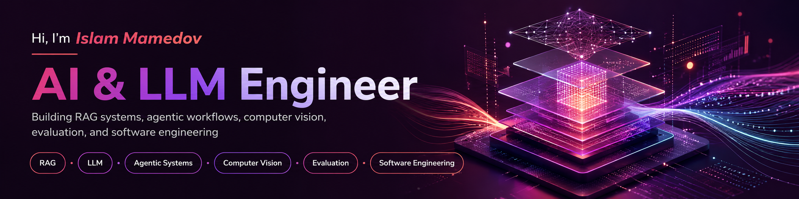

  

  <strong>I build grounded AI systems that connect models, data, tools, evaluation, and usable software.</strong>

  <a href="https://www.linkedin.com/in/islam-mamedov">LinkedIn</a>
  ·
  <a href="https://huggingface.co/islam-mamedov">Hugging Face</a>
  ·
  <a href="mailto:islammamedov132004@gmail.com">Email</a>

---

## About

I am a Computer Science graduate from **Swinburne University of Technology Sarawak**, with a double major in **Artificial Intelligence and Cybersecurity**.

I build complete AI applications that combine LLMs, retrieval, computer vision, backend services, databases, evaluation, testing, and user-facing interfaces.

I am open to graduate opportunities in **AI Engineering, LLM Engineering, Machine Learning, and Software Engineering**.

---

## Selected Projects

### 1. FastAPI Codebase Q&A

An evaluation-driven RAG system for asking technical questions about the FastAPI codebase.

The system searches source code, documentation, and resolved GitHub issues before generating an answer. It returns file, symbol, and line-level references so each response can be checked against the original source.

  

**Key engineering work**

- Built AST-aware code chunking with Tree-sitter
- Compared dense, hybrid, reranked, and query-rewritten retrieval
- Added grounded citations and evidence-aware refusal
- Created a labelled evaluation benchmark and regression pipeline

**Results:** Recall@5 `91%` · MRR `0.71` · Faithfulness `89%` · Correctness `91%` · Refusal accuracy `7/7`

**Stack:** Python · LLMs · RAG · Streamlit · ChromaDB · BGE Embeddings · Tree-sitter · Pytest

[Source Code](https://github.com/islam-mamedov/codebase-rag) · [Live Demo](https://huggingface.co/spaces/islam-mamedov/fastapi-codebase-qa)

---

### 2. InsightForge

An LLM-powered data analyst that investigates business questions against a PostgreSQL database.

The system plans an investigation, discovers the relevant schema, generates SQL, checks it for safety, executes it in a read-only transaction, validates the result, and explains the final findings.

  

**Key engineering work**

- Designed an eight-stage investigation workflow
- Added SQL safety inspection with SQLGlot and read-only execution
- Implemented automatic SQL repair and result validation
- Added token, latency, cost, and execution tracking

**Project snapshot:** `103 tests` · `~650,000 database rows` · `6 planted anomalies` · `3 repair attempts maximum`

**Stack:** Python · LLM Tool Calling · FastAPI · PostgreSQL · SQLAlchemy · SQLGlot · Docker · Pydantic

[Source Code](https://github.com/islam-mamedov/insightforge)

---

### 3. Concrete Inspection Agent

A multimodal AI system that combines concrete-defect detection with evidence-grounded repair guidance.

The vision model detects cracks, corrosion, and spalling. A LangGraph workflow then retrieves relevant information from USACE engineering guidance and uses that evidence to produce a cited response.

  

**Key engineering work**

- Fine-tuned YOLOv8 for three concrete-defect classes
- Built a LangGraph workflow with retrieval grading and query rewriting
- Added section-level citations and unsupported-question refusal
- Evaluated retrieval, citation validity, faithfulness, and refusal behaviour

**Results:** `1,770 images` · `5,897 objects` · Retrieval `28/28` · Citation validity `33/33` · Faithfulness `31/32`

**Stack:** Python · YOLOv8 · LLMs · LangGraph · LangChain · ChromaDB · Gradio

[Source Code](https://github.com/islam-mamedov/inspection-agent) · [Live Demo](https://huggingface.co/spaces/islam-mamedov/inspection-agent)

---

## Additional Work

### [Java Multi-Agent Vehicle Routing System](https://github.com/islam-mamedov/vrp-mas-intelligent-system)

A JADE-based routing system using master and delivery agents, genetic algorithms, simulated annealing, nearest-neighbour search, and local optimisation.

**Stack:** Java · JADE · Multi-Agent Systems · Genetic Algorithm · Simulated Annealing

### [Swinburne Campus App](https://github.com/islam-mamedov/swinburne-app-group13)

A mobile-first campus platform for navigation, safety, student support, events, and administration.

I worked mainly on the admin console, emergency and exit-management workflows, support features, full-stack integration, and team coordination.

**Stack:** Next.js · React · TypeScript · Supabase · Tailwind CSS

---

## Technical Skills

**AI & LLMs:** Large Language Models, RAG, LangGraph, tool calling, embeddings, vector search, prompt engineering, computer vision, object detection, model evaluation

**Backend & Data:** Python, FastAPI, PostgreSQL, SQLAlchemy, ChromaDB, Pydantic, REST APIs, Docker

**Software Engineering:** Java, TypeScript, Next.js, React, Git, Linux, testing, CI/CD

---

  <strong>Building AI systems that move from raw data to evidence, reasoning, and useful action.</strong>

  <a href="https://www.linkedin.com/in/islam-mamedov">LinkedIn</a>
  ·
  <a href="mailto:islammamedov132004@gmail.com">Contact me</a>

