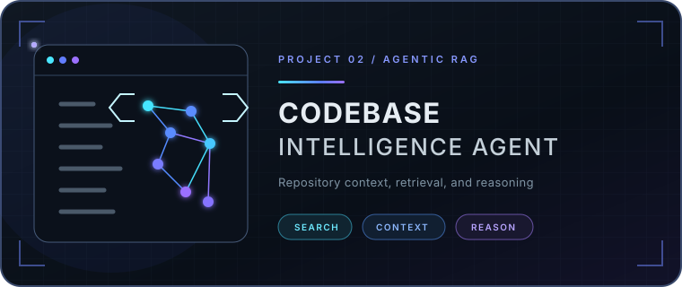

  

  <code>VISION</code>&nbsp;&nbsp;·&nbsp;&nbsp;
  <code>AGENTS</code>&nbsp;&nbsp;·&nbsp;&nbsp;
  <code>MEMORY</code>&nbsp;&nbsp;·&nbsp;&nbsp;
  <code>ACTION</code>&nbsp;&nbsp;·&nbsp;&nbsp;
  <code>SECURITY</code>

## Building systems that perceive, reason, remember, and act

I’m **Islam Mamedov**, an **AI Engineer** focused on computer vision, agentic AI, retrieval-augmented generation, and intelligent systems. I build AI systems that can understand complex inputs, work with knowledge, use tools, and turn information into practical outcomes.

My work sits at the intersection of visual understanding, grounded language systems, and tool-using agents—especially where they can support inspection, software intelligence, and data analysis.

## AI systems I build

| System module | Engineering focus |
| :--- | :--- |
| **Eyes · Vision** | Computer vision, detection, and visual inspection |
| **Neural core · Intelligence** | LLM-powered agents, planning, and reasoning workflows |
| **Memory · Retrieval** | Vector search and RAG for grounded, context-aware systems |
| **Hands · Action** | Automation, tool use, and agentic workflows |
| **Shield · Security** | Cybersecurity-aware thinking for intelligent systems |

## Featured projects

<table>
  <tr>
    <td width="50%" valign="top">
      
      <h3>Concrete Inspection Agent</h3>
      

        A computer-vision agent for analysing concrete surfaces and supporting
        inspection workflows.
      

      
<code>Computer Vision</code> · <code>Inspection</code> · <code>Agents</code>

    </td>
    <td width="50%" valign="top">
      
      <h3>Codebase Intelligence Agent</h3>
      

        An agentic system for exploring repositories, retrieving relevant
        context, and reasoning over software projects.
      

      
<code>Agentic AI</code> · <code>RAG</code> · <code>Code Intelligence</code>

    </td>
  </tr>
  <tr>
    <td colspan="2" valign="top">
      
      <h3>InsightForge · AI Data Analyst</h3>
      

        An AI-assisted analyst for turning raw datasets into guided analysis,
        explainable insights, and clearer decisions.
      

      
<code>Data Analysis</code> · <code>Agents</code> · <code>Intelligent Systems</code>

    </td>
  </tr>
</table>

<!--
TODO for the next content pass:
- Add confirmed repository and demo links to the three project cards.
- Add only verified languages, frameworks, vector databases, and platforms.
- Add public LinkedIn, portfolio, email, location, and availability if desired.
-->

---

  Exploring how AI can perceive the physical world, work with knowledge, and take useful action.

