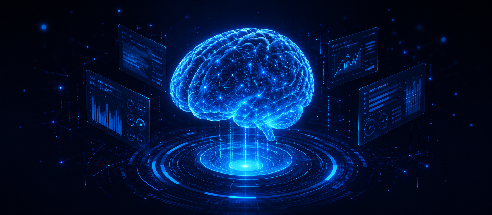

<!-- =========================================================
     AI ENGINEER GITHUB PROFILE README
     Replace placeholder links, text and asset images later
========================================================== -->

 

<table>
<tr>

<!-- ==================== LEFT PROFILE COLUMN ==================== -->

<td width="30%" valign="top" align="center">

 

<h1>Your Name</h1>

<h3>
  AI Engineer
</h3>

Building intelligent AI solutions that solve real-world problems and create meaningful impact.

 

---

 

📍 Your City, Country

  

📧 [youremail@example.com](mailto:youremail@example.com)

  

💼 [LinkedIn Profile](https://www.linkedin.com/in/YOUR-LINKEDIN)

  

💻 [GitHub Profile](https://github.com/YOUR-USERNAME)

 

  

---

 

⚡ **Fun fact:** I automate boring tasks so I can spend more time building useful things.

 

</td>

<!-- ==================== RIGHT MAIN COLUMN ==================== -->

<td width="70%" valign="top">

 

<h3>👋 Hi, I’m Your Name</h3>

<h1>AI Engineer</h1>

I build end-to-end AI solutions that combine data, trained models and software engineering to deliver measurable impact. My interests include computer vision, generative AI, retrieval-augmented generation and agentic systems.

 

  

<!-- ==================== ABOUT + TECH STACK ==================== -->

<table>
<tr>

<td width="52%" valign="top">

<h2>👤 About Me</h2>

AI Engineer with a strong foundation in machine learning, deep learning and software engineering. I enjoy turning complex technical problems into practical and scalable AI products.

<ul>
  <li>Building end-to-end ML and deep-learning systems</li>
  <li>Training and evaluating custom computer-vision models</li>
  <li>Developing RAG pipelines and agentic AI workflows</li>
  <li>Deploying interactive AI applications</li>
  <li>Learning continuously through practical projects</li>
</ul>

</td>

<td width="48%" valign="top">

<h2>🛠️ Tech Stack</h2>

  

  

</td>

</tr>
</table>

 

<!-- ==================== FEATURED PROJECTS ==================== -->

<h2>📁 Featured Projects</h2>

<table>
<tr>

<td width="33%" valign="top">

<h3>🤖 AI Chat Assistant</h3>

Conversational AI assistant powered by LLMs, retrieval-augmented generation and document-grounded responses.

🔗 [View Repository](YOUR-PROJECT-LINK)

</td>

<td width="33%" valign="top">

<h3>📊 ML Prediction System</h3>

Machine-learning application that prepares data, trains models, evaluates performance and produces predictions.

🔗 [View Repository](YOUR-PROJECT-LINK)

</td>

<td width="33%" valign="top">

<h3>👁️ Computer Vision</h3>

Deep-learning system for detecting and classifying objects from images using custom-trained vision models.

🔗 [View Repository](YOUR-PROJECT-LINK)

</td>

</tr>
</table>

 

<!-- ==================== GITHUB STATS ==================== -->

<h2>📊 GitHub Statistics</h2>

 

 

<!-- ==================== CONNECT ==================== -->

<h2>🤝 Let’s Connect</h2>

I am open to collaborating on AI projects, discussing engineering ideas and exploring opportunities in artificial intelligence, computer vision and agentic systems.

 

  <i>Thanks for visiting my profile.</i> ⭐

</td>

</tr>
</table>
