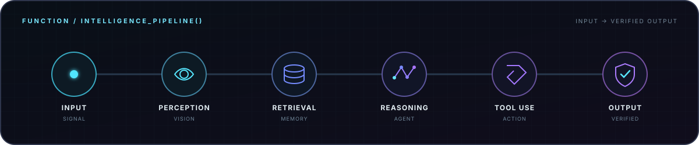

<p align="center">
  
</p>

<p align="center">
  
</p>

<p align="center">
  <a href="#system-core"><kbd> SYSTEM CORE </kbd></a>
  &middot;
  <a href="#featured-builds"><kbd> FEATURED BUILDS </kbd></a>
  &middot;
  <a href="#agent-console"><kbd> AGENT CONSOLE </kbd></a>
</p>

<br />

## System Core

<p align="center">
  <samp>01 // ARCHITECTURE</samp><br /><br />
  <strong>Engineering AI systems that perceive, reason, remember, and act.</strong>
</p>

<p align="center">
  
</p>

<br />

## Featured Builds

<p align="center"><samp>02 // LAB MODULES</samp></p>

<p align="center">
  
</p>

<p align="center">
  
</p>

<p align="center">
  
</p>

<br />

## Agent Console

<p align="center"><samp>03 // EXECUTION LAYER</samp></p>

<details>
  <summary><strong>▶ RUN &nbsp; intelligence_pipeline()</strong></summary>
  <br />
  <p align="center">
    
  </p>

```text
function intelligence_pipeline(signal):
    perception = vision.scan(signal)
    context    = memory.retrieve(perception)
    plan       = agent.reason(context)
    result     = tools.execute(plan)
    return guard.verify(result)
```

</details>

<br />

<p align="center">
  
</p>
